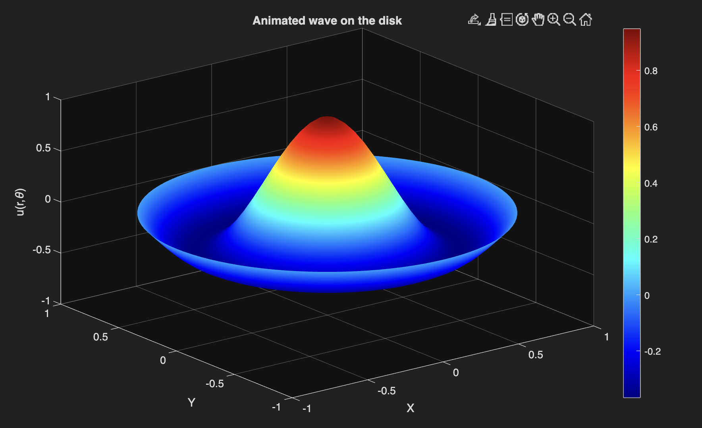
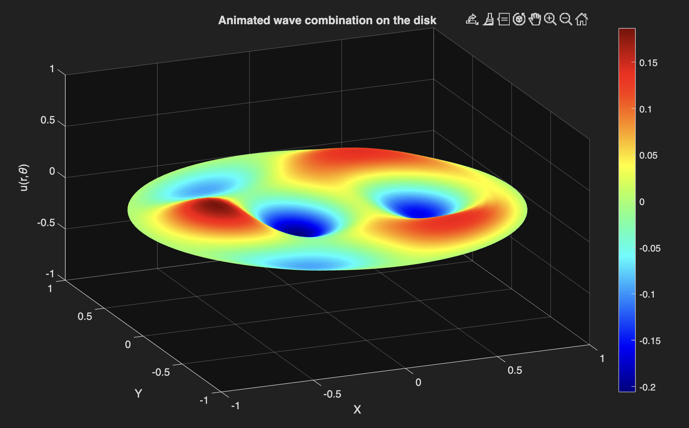

# Wave Propagation on a Circular Membrane (MATLAB)

## Description
Numerical simulation of the 2D wave equation on a disk using finite
difference methods in polar coordinates. Comparison with analytical
solutions via Bessel functions.

## Physics background
- Wave equation in polar coordinates
- Dirichlet boundary conditions
- Bessel functions J_m and eigenvalues λ_{m,n}

## Numerical method
- Explicit finite differences
- CFL condition analysis
- Error and phase shift study

## How to run
1. Open MATLAB
2. Run `src/main.m`

## Results

### Mode m=0 n=1

### Linear combination of four different modes

## Future work
- Quantum analogy (2D Schrödinger equation)
- Demonstration of the Aharonov–Bohm effect
